#DeployD an AI deployment intelligence platform

## Problem
Production systems generate events but lack casual understanding.
## Our Solution
Event-driven system + casual graph + AI reasoning Layer

## Architecture

## Running it:
- docker-compse up

## For the demo:
- deploy -> anomaly on latency spike
- dependecy failure -> cascade

## What we measure
- MTTD
- precision/recall
